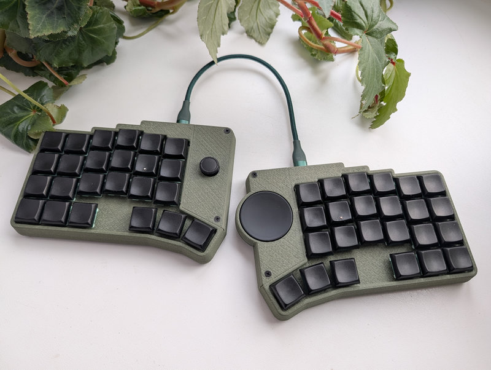

# Cornedeon v2mod Keyboard

Modular Cornedeon split keyboard.

Keyboard Maintainer: [alko](https://github.com/alko-kbd/cornedeon_2mod) [alko-kbd@alk0.ru](mailto:alko-kbd@alk0.ru)

Web Site: [cornedeon.ru](https://cornedeon.ru)

Hardware Supported: Handwired, RP2040, Trackpads, Trackpoints, Joystick.

**Revision 2mod**

Support for custom modules on same case, as trackpoint, trackpad, encoders, joystick etc.

**Build**

git clone --recurse-submodules https://github.com/vial-kb/vial-qmk.git

Prepare [build environment](https://get.vial.today/docs/porting-to-vial.html).

Copy folder cornedeon_2mod_joy_tpad to vial-qmk/keyboards/alko.

qmk compile -kb alko/cornedeon_2mod -km vial
